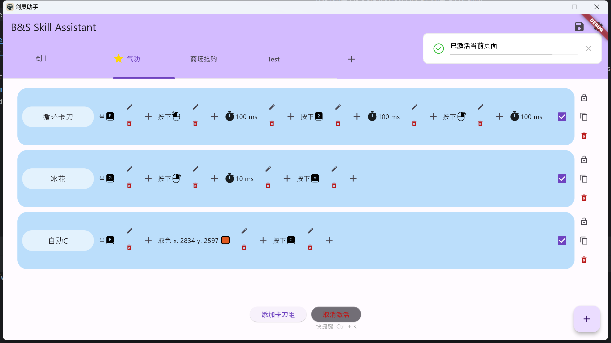

# B&S Skill Assistant

一个开源免费的剑灵怀旧服卡刀助手（理论上也支持现网服），支持鼠标、键盘、取色宏，安全、易用、可扩展。

## 免责声明

本项目仅供学习交流使用，不得用于商业用途，请严格遵守AGPL协议，如有侵权请联系作者删除。

本人不接受任何形式的捐赠或者资助，也不会提供任何形式的技术支持，如有问题请在GitHub上提issue。

本软件不会记录任何用户信息，不修改任何其它应用程序的数据，也不会上传任何数据到服务器，所有数据均保存在本地。

本软件所有源码公开可查，请认准本仓库分发的应用程序，不承担任何别人修改后的应用程序可能带来的风险。

使用卡刀软件有封号风险（原理和其它卡刀软件并没有差别，请谨慎使用），建议只用在技能连招上，本人不承担任何使用本软件导致的封号风险。

## 背景

市面上有很多卡刀软件，但是大多数都是收费的，而且不开源，不安全，不易用，不可扩展。于是萌生出自己写一个开源免费的剑灵卡刀助手的想法，便就有了这个项目。

