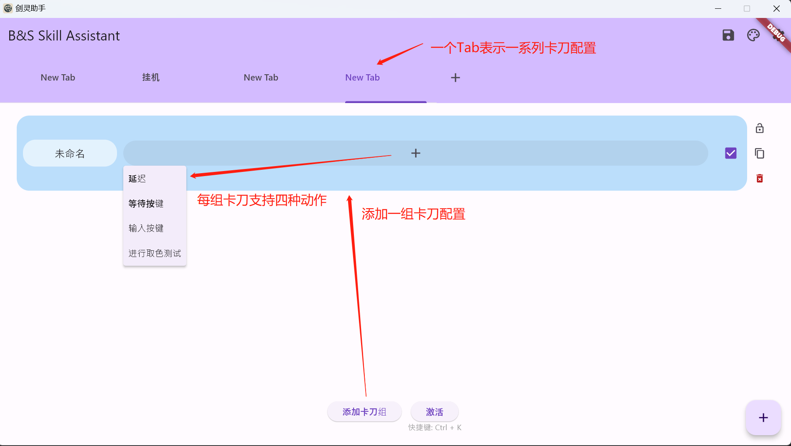
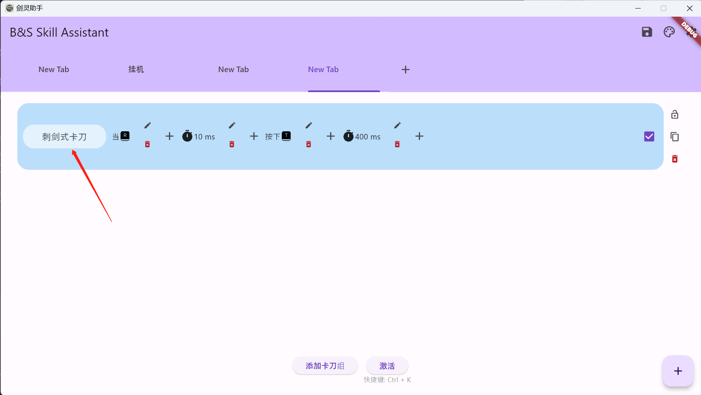
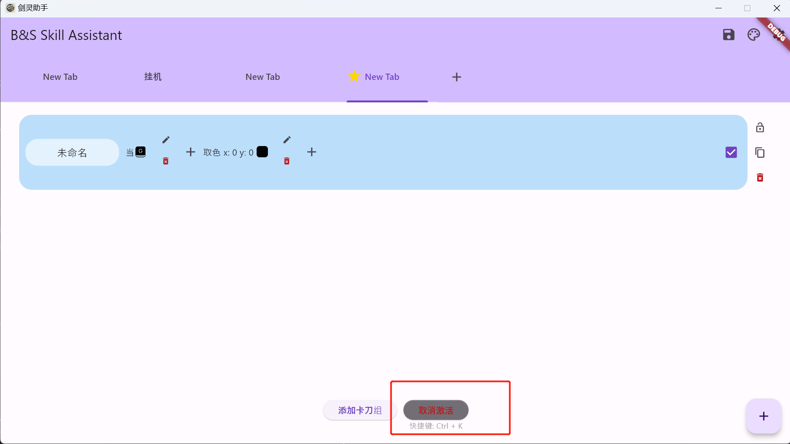
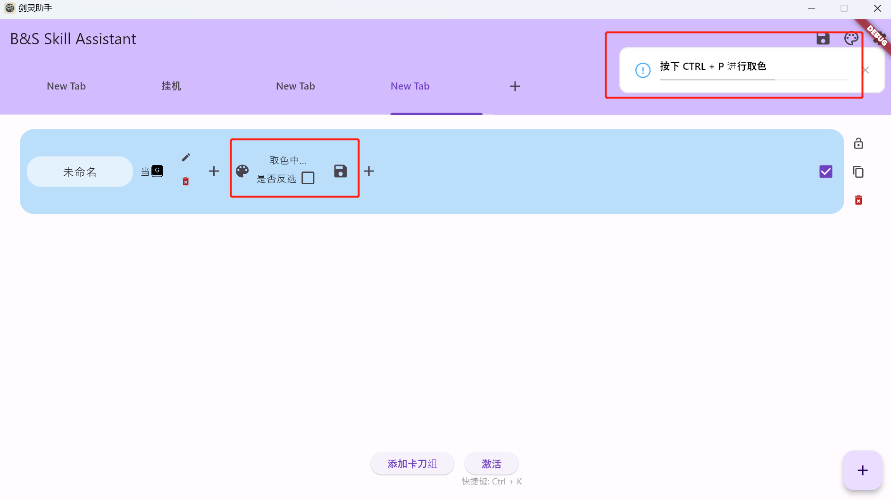

# 使用教程

## 1. 安装与运行

可以直接下载构建好的release包，解压后保存到任意目录，然后`右键` -> `以管理员身份运行` -> `bns_skill_assistant.exe`即可。

## 2. 使用方法

### 主界面

### 卡刀配置
- 延迟：技能连招之间的间隔时间，单位毫秒
- 等待按键：一般可以作为卡刀触发器，等待鼠标点击、键盘输入等
- 输入按键：模拟鼠标、键盘输入
- 进行颜色测试：取色，可以判断当前技能是否可用

### 例子
#### 剑士刺剑式卡刀

卡刀说明
- 等待按键[R]：使用`R`触发卡刀，`R`键本身是普攻
- 延迟[10]：延迟10ms进入下一个动作
- 输入按键[T]：触发刺剑技能
- 延迟[400]：延迟400ms，这是一个GCD，不然快速点击R会打乱卡刀节奏

## 3. 激活
激活当前Tab，可以点击`激活`按钮，即可激活。
也可以是使用`CTRL + K`快捷键激活。

取消激活同理。

## 4. 高级用法
### 取色
有时候使用取色可以精准的判断技能是否可用，比如气功的莲花指[C]，可以通过取色判断技能是否可用，只有莲花指可用时才触发[C]，不然可能会自动放罩子。

### 增加取色动作
增加取色动作后，可以点击编辑，然后进入取色环节

切换到`游戏界面`，确定需要取色的地方，按下`CTRL + P`快捷键，左键点击屏幕上的某个点，记录下这个点的颜色，然后点击保存即可。